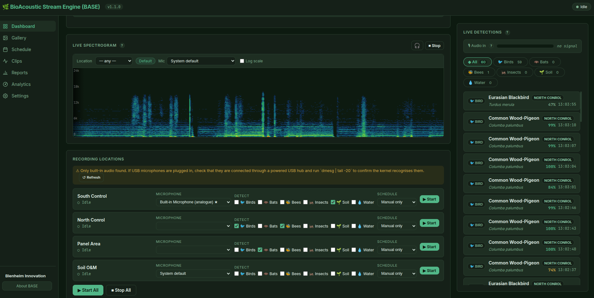
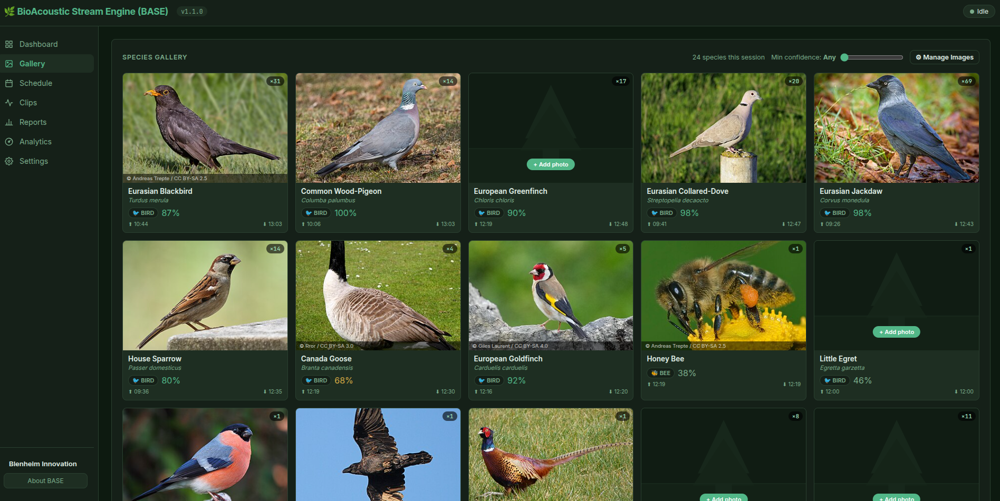
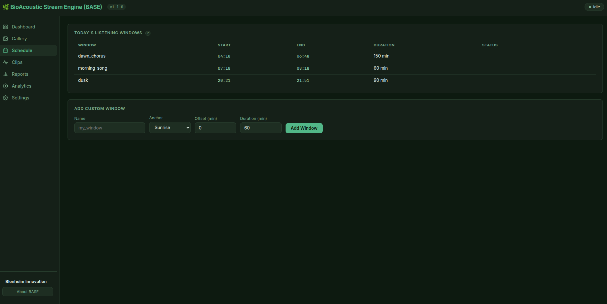
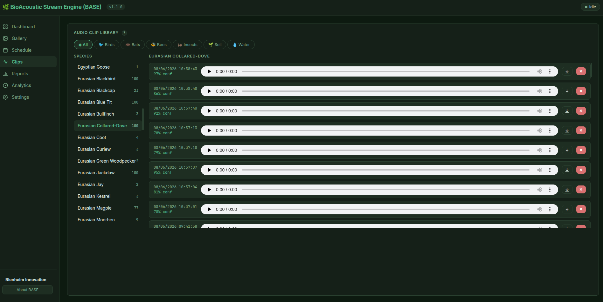
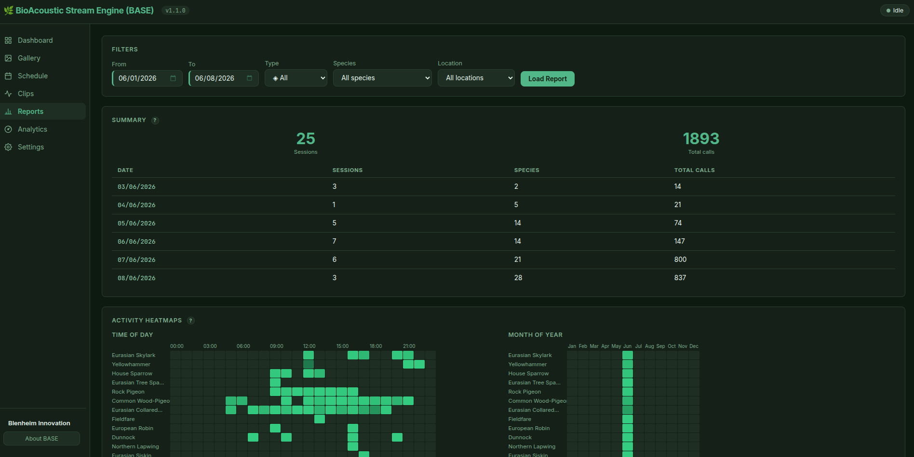
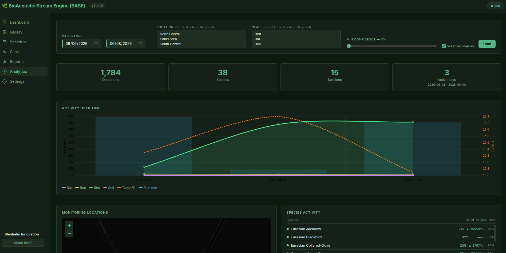
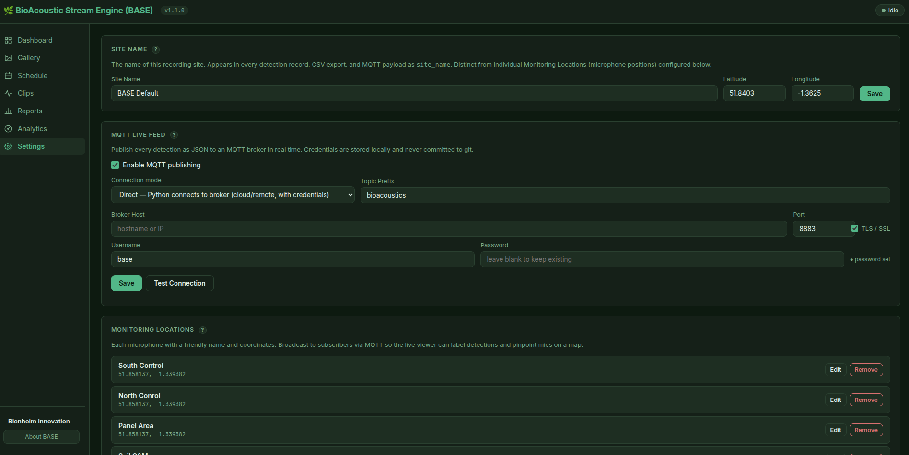
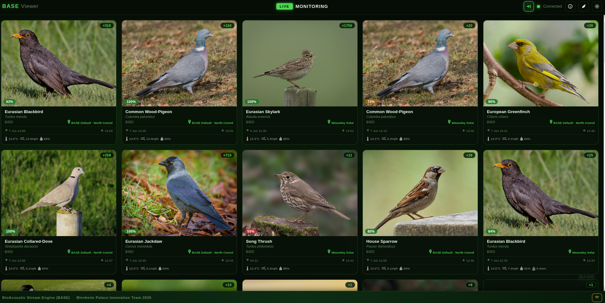

# BioAcoustic Stream Engine (BASE)

*Created by **David Green** — Head of Innovation and AI, Blenheim Palace*

A real-time bioacoustic monitoring platform originally created for Blenheim Estate. Continuously streams live audio from field microphones, identifies species using AI classifiers, and logs every detection with confidence scores, timestamps, and call counts. Built to scale across birds, bats, insects, and soil acoustics.

This project was born from a belief that technology can bring people closer to the natural world. By making acoustic biodiversity monitoring open, accessible, and shareable, the goal is to engage more people with nature — learning together, sharing what we hear, and building a deeper collective understanding of the living world around us.

---

## Screenshots


| Dashboard | Gallery |
|---|---|
|  |  |

| Schedule | Clips Library |
|---|---|
|  |  |

| Reports | Analytics |
|---|---|
|  |  |

| Settings | BASE Viewer |
|---|---|
|  |  |

---

## Features

- **Live microphone streaming** — continuous audio capture with configurable chunk size; multiple concurrent microphones supported via a many-to-many mic-to-classifier mapping; each monitoring location has its own device, classifier list, and schedule
- **BirdNET identification** — powered by [BirdNET-Analyzer](https://github.com/kahst/BirdNET-Analyzer) via [birdnetlib](https://github.com/joeweiss/birdnetlib); identifies 6,000+ species
- **Bat detection** — powered by [BatDetect2](https://github.com/macaodha/batdetect2); 17 UK/European species; requires an ultrasonic microphone (≥384 kHz)
- **Soil Acoustic Index (SAI v2)** — Blenheim Innovation; NDSI + bio-band RMS + transient gate; rejects traffic rumble, mains hum, propeller and helicopter noise; contact/geophone microphone
- **Water Acoustic Index (WAI, beta)** — Blenheim Innovation; NDWI + bio-band RMS + ACI; designed for freshwater hydrophone deployments; detects fish choruses and invertebrate activity (300–5000 Hz)
- **Scheduled listening** — automatically wakes and sleeps around dawn chorus, morning song, and dusk windows calculated from local sunrise/sunset
- **Adaptive scheduling** — if nocturnal species (owls, nightjars) are detected, a night window is automatically added
- **Auto-resume on boot** — configurable via dashboard; BASE resumes recording automatically after a power cut or system restart without any manual intervention
- **Detailed logging** — every detection logged with date, time, species, scientific name, confidence, call number, monitoring location, and weather data
- **Session summaries** — per-window species totals with max and average confidence
- **Live MQTT streaming** — every detection published as JSON in real time; direct or bridge connection; configurable via web UI; each payload carries full site and monitoring-location coordinates and current weather
- **Browser dashboard** — full web UI for live monitoring; per-microphone device assignment, classifier selection, and schedule control all on the dashboard; audio clips, reports, and settings
- **Live spectrogram** — real-time audio frequency display with location-name dropdown; classifier-specific presets auto-zoom to the relevant frequency band (birds 0.3–12 kHz, bats 15–120 kHz, bees 0.08–4 kHz, insects 3–20 kHz, soil 0.03–2 kHz, water 0.01–8 kHz) and tune sensitivity accordingly; headphone monitoring; bat streams at 384 kHz with browser-side frequency division to bring ultrasonic calls into audible range
- **Analytics dashboard** — historical overview with date-range and multi-select filters for locations and classifiers; activity-over-time chart (Chart.js) with optional Open-Meteo weather overlay (temperature, rainfall); species cards with trend vs the previous equal-length period; interactive Leaflet map of monitoring locations styled in brand colours with auto-fitBounds
- **Kiosk mode** — `start_kiosk.sh` launches Chrome or Firefox in full-screen kiosk mode pointing at `localhost:8000`; `install.sh` creates a desktop shortcut and an `~/.config/autostart/` entry so the display comes up automatically on login
- **Species gallery** — live photo grid that populates as species are detected; confidence filter, detection counts, CC attribution overlays; replace stock images with your own photographs via the built-in upload tool
- **BASE Viewer** — a separate ambient display page (`/viewer/`) showing live species detections as a full-screen photo grid with sounds; suitable for kiosks, public screens, and Yodeck deployments; PWA-ready with service worker caching for instant load from home screen; reconnects to MQTT automatically when returning from background
- **Extensible architecture** — water, insect, and additional classifiers slot in via the REGISTRY pattern

---

## Quick Start

The easiest way to install is with the provided script — it handles all system libraries, Python packages, the BuzzDetect bee model, and config files in one step:

```bash
git clone https://github.com/blenheiminnovation/BioAcousticStreamEngine.git
cd BioAcousticStreamEngine
bash install.sh
```

Then launch the web UI:

```bash
bash start_web.sh
```

A browser tab opens automatically at `http://localhost:8000`. Edit `config/settings.yaml` to set your recording location and active classifiers.

---

### Manual install

If you prefer to install step by step:

#### 1. System libraries

```bash
sudo apt-get install -y \
  libportaudio2 \
  libsndfile1 \
  python3-venv \
  python3-dev \
  git
```

> **Audio device listing** (web UI): also requires `pactl`, which ships with PipeWire/PulseAudio. Install with `sudo apt-get install -y pipewire-pulse` if not already present.

#### 2. Python environment

```bash
python3 -m venv .venv
.venv/bin/pip install -e "."
git config core.hooksPath .githooks
```

> The last line activates the pre-commit hook that keeps `viewer/viewer.js` version in sync with `pyproject.toml` automatically on every commit.

#### 3. Bee classifier model (BuzzDetect)

No action needed — if `bee` is active in `config/settings.yaml`, BASE downloads the BuzzDetect model automatically on first run (~16 MB, one-time).

> **Requires `git`** — the auto-download uses `git clone`. If `git` is not installed the bee classifier will be silently disabled rather than crash, but you will get no bee detections. Install it with:
> ```bash
> sudo apt-get install -y git
> ```

#### 4. Output directories and config

```bash
mkdir -p output/clips
cp config/settings.yaml.example config/settings.yaml
cp config/secrets.yaml.example config/secrets.yaml
```

Edit `config/settings.yaml` to set your location (latitude/longitude) and which classifiers to run.

#### 5. Run

```bash
# Launch the web UI (recommended)
bash start_web.sh

# Or use the command line:
.venv/bin/python -m ecoacoustics.main wake            # listen until Ctrl+C
.venv/bin/python -m ecoacoustics.main wake --duration 30  # listen for 30 min
.venv/bin/python -m ecoacoustics.main schedule        # run dawn/dusk schedule
.venv/bin/python -m ecoacoustics.main status          # today's summary
.venv/bin/python -m ecoacoustics.main list-devices    # list microphones
```

---

### Raspberry Pi (untested — community feedback welcome)

BASE is built on cross-platform Python and *should* run on a Raspberry Pi, but it has not yet been validated end-to-end on Pi hardware. The notes below are best-guess guidance — please open an issue if you hit something that needs documenting.

#### Recommended hardware

- **Raspberry Pi 5** (4 GB or 8 GB) if you want to run several classifiers concurrently. A **Pi 4 (≥4 GB)** will work for one or two classifiers but is likely to be CPU-bound with birds + bees + insects all active.
- **Active cooling** — heatsink + fan, or the official Pi 5 active cooler. Continuous ML inference will pin the CPU and trigger thermal throttling without it.
- **Quality power supply** — the official 27 W USB-C PSU for Pi 5, or 15 W for Pi 4. Under-volting corrupts SD cards.
- **USB SSD for clip storage** — clip files accumulate quickly under 24/7 monitoring and SD cards wear out under sustained writes. Use an external SSD for any deployment longer than a few days.
- **USB microphone** — the Pi's 3.5 mm jack is output-only. For ultrasonic bat capture (≥192 kHz) you need a dedicated probe such as the [Dodotronic UltraMic 192K](https://www.dodotronic.com/) or [Pettersson M500-384](https://batsound.com/product/m500-384/).

#### OS and Python version

- Use **Raspberry Pi OS Bookworm (64-bit)** — flash with [Raspberry Pi Imager](https://www.raspberrypi.com/software/). The 32-bit (armv7l) image will not work; TensorFlow and PyTorch only publish aarch64 wheels.
- Bookworm ships with **Python 3.11**, which is the recommended target. `pyproject.toml` requires `>=3.10`; **3.10, 3.11, and 3.12** all satisfy TensorFlow 2.16+ and current PyTorch. Avoid 3.13+ until you've confirmed every model dependency still publishes wheels.
- The [piwheels](https://www.piwheels.org/) ARM wheel index is enabled by default on Pi OS — most `pip install` calls will pull pre-built binaries rather than compile from source.

#### Install steps

The [Manual install](#manual-install) steps above should work as-is on a Pi:

```bash
sudo apt-get update
sudo apt-get install -y libportaudio2 libsndfile1 python3-venv python3-dev git pipewire-pulse
git clone https://github.com/blenheiminnovation/BioAcousticStreamEngine.git
cd BioAcousticStreamEngine
python3 -m venv .venv
.venv/bin/pip install -e "."
```

Heads-up: the first install pulls down TensorFlow + PyTorch (via BatDetect2) and is large (~1.5 GB on disk). Budget **15–30 min on a Pi 4** for the pip step; SD-card I/O dominates.

#### Likely gotchas

- **`tensorflow-cpu` may not have an aarch64 wheel.** [pyproject.toml](pyproject.toml#L20) pins `tensorflow-cpu>=2.16`, but `tensorflow-cpu` is historically an x86_64-only PyPI package. On Pi you may need to swap it for the regular `tensorflow` package (which *does* publish aarch64 wheels from 2.15+), or replace it with `tflite-runtime` since birdnetlib only needs TFLite at runtime. If `pip install -e .` fails on the TensorFlow line, edit pyproject.toml and try `tensorflow>=2.16` or `tflite-runtime`.
- **BirdNET via TFLite is comfortably real-time** on a Pi 4 with one microphone. This is the lightest classifier — start here.
- **BatDetect2** uses PyTorch and is **~5–10× slower on Pi 4 than desktop** for ultrasonic CNN inference. Workable, but consider a longer chunk duration or scheduling it to specific dusk/dawn windows only. Pi 5 handles it more comfortably.
- **OpenSoundscape (insect classifier)** drags in the full PyTorch wheel (~500 MB) and is the heaviest single dependency. Consider running the insect classifier only in scheduled windows rather than 24/7.
- **Running every classifier at once** will likely exceed a Pi 4's CPU budget. Use the *Schedule → Classifiers & Microphones* panel to disable classifiers you don't need, or to stagger them across listening windows.
- **PipeWire / `pactl` device listing**: Bookworm uses PipeWire with the PulseAudio shim, so the web UI's device picker works out of the box. On a stripped-down headless install you may need `sudo apt-get install -y pipewire-pulse` explicitly.
- **Headless operation**: SSH in, run `bash start_web.sh`, then point a browser from another machine at `http://<pi-hostname>.local:8000`. The Pi 4's HDMI-attached browser will struggle to render the live spectrogram smoothly — view it remotely.
- **MQTT**: the Mosquitto broker runs natively on Pi (`sudo apt-get install -y mosquitto`); no Pi-specific changes needed beyond the standard [MQTT](#mqtt) section.

#### Useful links

- [Raspberry Pi OS download / Pi Imager](https://www.raspberrypi.com/software/) — flash Bookworm 64-bit
- [piwheels.org](https://www.piwheels.org/) — pre-built ARM Python wheels for Pi
- [TensorFlow pip install matrix](https://www.tensorflow.org/install/pip) — confirm aarch64 wheel availability for your Python version
- [PyTorch get-started](https://pytorch.org/get-started/locally/) — aarch64 wheels are first-class for Linux
- [BirdNET-Pi project](https://github.com/Nachtzuster/BirdNET-Pi) — community Pi-only BirdNET deployment; useful prior art for audio tuning and systemd setup
- [Dodotronic UltraMic](https://www.dodotronic.com/) / [Pettersson M500-384](https://batsound.com/product/m500-384/) — ultrasonic microphone suppliers for bat detection

---

## Web UI

BioAcoustic Stream Engine (BASE) includes a browser-based dashboard for managing and monitoring the system without touching the command line.

```bash
.venv/bin/python -m ecoacoustics.main web
```

A browser tab opens automatically at `http://localhost:8000`. A desktop launcher is also provided — double-click `bioacoustic-stream-engine.desktop` to start.

### Pages

| Page | Features |
|---|---|
| **Dashboard** | Live detection feed, real-time VU meter, per-microphone device assignment, classifier selection (🐦🦇🐝🦗🌱💧), and schedule mode (auto/manual); start/stop per mic; today's species count and call totals; live spectrogram with location dropdown and headphone monitoring |
| **Gallery** | Live photo grid populated as species are detected; confidence threshold filter; detection counts; CC attribution overlays; upload your own images per species |
| **Schedule** | Today's listening windows, add/remove custom windows |
| **Clips** | Browse saved audio clips by species and classifier, play in browser, delete clips |
| **Reports** | Date and species filtering, daily summary table, download detections/sessions as CSV, clear all logs |
| **Analytics** | Date-range and multi-select filters (locations, classifiers, confidence); activity-over-time chart with Open-Meteo weather overlay; species trend cards vs previous period; Leaflet map of monitoring locations |
| **Settings** | Recording location (name, lat/lon), monitoring locations (mics list with individual lat/lon), MQTT broker configuration with connection test, classifier device and location assignment |
| **Viewer** | Ambient full-screen species gallery served at `/viewer/`; connects directly to the MQTT broker; suitable for kiosks and public displays — see [BASE Viewer](#base-viewer) |

### Web command options

```bash
.venv/bin/python -m ecoacoustics.main web --port 8080   # change port
.venv/bin/python -m ecoacoustics.main web --no-browser  # don't auto-open browser
```

---

## Species Gallery

The Gallery page builds a live photo grid as species are detected during a session. Each card shows a photograph of the species, its common and scientific name, classifier type, best confidence score, and a detection count. The grid updates in real time via WebSocket — no page refresh needed.


### Stock images

108 UK species images are bundled with BASE, sourced from [Wikimedia Commons](https://commons.wikimedia.org/) under open Creative Commons licences. Attribution is displayed as an overlay on each card and stored in `src/ecoacoustics/web/species_images/_credits.json`.

### Replacing or adding images

Any stock image can be replaced with your own photograph directly from the gallery:

- **Cards with no image** show a "+ Add photo" button over the placeholder — click it to upload without leaving the gallery.
- **Gallery → Manage Images** lets you upload a replacement for any species and edit the copyright attribution (author, licence, source URL).

Accepted formats: JPEG, PNG, WebP. Images are saved into `src/ecoacoustics/web/species_images/` and served statically.

### Confidence filter

A slider in the gallery header filters cards by minimum confidence score (0–95% in 5% steps). The species count updates to show how many species are visible versus total detected. The threshold is remembered while navigating between pages.

### MQTT image field

Every MQTT detection payload includes a `species_image` field (e.g. `"european_robin.jpg"`) so downstream systems can display the matching photograph without needing to normalise the species name themselves.

---

## BASE Viewer


The Viewer is an ambient display page served at `http://localhost:8000/viewer/`. It connects directly to your MQTT broker and shows live species detections as a full-screen photo grid with sounds — designed for kiosk screens, public displays, and remote monitoring rooms.

It is also available as a standalone file (`viewer/index.html`) that can be opened directly in a browser without the BASE server.

### What it shows

- **Full-screen gallery** — species cards fill the screen as detections arrive, sorted most-recent first; scrolls automatically when more than ~3 rows are detected
- **Animated listening state** — when no species have been detected, a pulsing bar animation confirms the system is live and listening
- **Location per card** — each card shows `Site · Monitoring Location` (e.g. *Charlbury · Garden*); detections from different sites are always kept on separate cards and never merged
- **Confidence badge** — colour-coded percentage on each card (green ≥70%, amber ≥45%, red below)
- **Detection count** — `×N` badge shows how many times that species has been detected in the session
- **First / last seen timestamps** on every card

### Confidence filter

A slider at the top of the gallery sets the minimum confidence for cards to appear. Cards below the threshold are hidden, not deleted.

| URL parameter | Effect |
|---|---|
| `probability=0.6` | Pre-set the confidence threshold to 60% on load |
| `broker=wss://host:8084/mqtt` | Auto-connect to this broker on load |
| `prefix=bioacoustics` | Set the topic prefix (default: `bioacoustics`) |

Example URL for a kiosk screen (set credentials in the Settings panel on the device, not in the URL):

```
http://localhost:8000/viewer/?probability=0.65
```

### Sounds

Upload up to 5 audio recordings per species (MP3, WAV, OGG). Each time that species is detected, one recording is chosen at random and played — building a live ambient soundscape. Up to 3 sounds can play simultaneously.

1. Click any species card → detail panel opens
2. Under **Sounds**, click **+ Upload** and select audio files
3. Click **▶** to preview; **✕** to remove

### Photos

Stock images for 108 UK species are bundled. Replace any with your own photograph by clicking the card and uploading a JPEG, PNG, or WebP file. Photos are stored in the browser's IndexedDB and persist across sessions.

### Detection retention

Cards automatically disappear once a species hasn't been detected for longer than the configured retention period. Set via **⚙ Settings → Keep detections for** — options range from 1 hour to Unlimited, defaulting to **1 day**. A background sweep runs every 2 minutes and also runs immediately on page load to discard entries older than the current setting.

### Explainer panel

A collapsible **How BASE Works** panel explains the system to visitors. Click **✕** to hide it (preference is remembered); click **ℹ** in the header to show it again.

---

## Kiosk Mode

`install.sh` creates two launch shortcuts during installation:

- **Desktop shortcut** — `~/Desktop/base-kiosk.desktop` (double-click to open BASE in full-screen kiosk mode)
- **Autostart entry** — `~/.config/autostart/base-kiosk.desktop` launches the kiosk automatically on desktop login

Both shortcuts invoke `start_kiosk.sh`, which:

1. Waits up to 60 seconds for the BASE server to become available at `localhost:8000`
2. Launches the browser in full-screen kiosk mode — tries `google-chrome`, then `chromium-browser`, `chromium`, and finally `firefox` in that order

To start the kiosk manually:

```bash
bash start_kiosk.sh
```

The kiosk browser opens with popups, address bar, and desktop decorations hidden, making it suitable for public-facing displays. Pair with the [Running 24/7](#running-247-continuous-monitoring) steps to have BASE and the kiosk come up automatically after a power cycle.

---

## Running 24/7 (Continuous Monitoring)

BASE is designed to run unattended around the clock. Follow these steps to keep it running reliably.

### 1. Enable autostart (already configured)

The web UI and pipeline autostart on login via a systemd user service. Verify it is enabled:

```bash
systemctl --user status bioacoustic-stream-engine
```

### 2. Enable linger — keep the service alive when logged out

By default, user services stop when you log out of the desktop. Enable linger so BASE keeps running regardless:

```bash
loginctl enable-linger $USER
```

### 3. Prevent the system from sleeping

```bash
# Stop the OS from suspending automatically
sudo systemctl mask sleep.target suspend.target hibernate.target hybrid-sleep.target

# Prevent screen blanking (useful if monitoring the spectrogram)
gsettings set org.gnome.settings-daemon.plugins.power sleep-inactive-ac-timeout 0
gsettings set org.gnome.desktop.session idle-delay 0
```

### 4. Prevent lid close from suspending (laptops)

```bash
sudo sed -i 's/#HandleLidSwitch=suspend/HandleLidSwitch=ignore/' /etc/systemd/logind.conf
sudo sed -i 's/#HandleLidSwitchExternalPower=suspend/HandleLidSwitchExternalPower=ignore/' /etc/systemd/logind.conf
sudo systemctl restart systemd-logind
```

### 5. Keep it plugged in

Battery depletion will stop recording. If running on a laptop, connect AC power and set the power button action to **Do Nothing** in system settings.

### Verify end-to-end

After applying the above, reboot and confirm BASE is running without logging in:

```bash
systemctl --user is-active bioacoustic-stream-engine   # should print: active
```

---

## Commands

| Command | Description |
|---|---|
| `wake` | Start listening immediately. Optional `--duration MINUTES`. |
| `schedule` | Auto wake/sleep based on configured listening windows. |
| `status` | Display today's schedule and species detected so far. |
| `list-devices` | Print available audio input devices and their indices. |
| `web` | Launch the browser UI. Optional `--port` and `--no-browser`. |

---

## Output

Results are written to the `output/` directory (created automatically).

### `output/detections.csv` — one row per detection

| Column | Description |
|---|---|
| `session_id` | Unique 8-character ID for the listening session |
| `window_name` | Which schedule window (dawn_chorus, dusk, manual, …) |
| `date` | YYYY-MM-DD |
| `time` | HH:MM:SS |
| `classifier` | Model used (bird, bat, bee, insect, soil, water) |
| `species_common` | Common name, e.g. *Robin* |
| `species_scientific` | Scientific name, e.g. *Erithacus rubecula* |
| `confidence` | BirdNET confidence score (0–1) |
| `call_number_in_session` | Running count of calls for this species this session |
| `latitude` / `longitude` | Recording location coordinates |
| `monitoring_location` | Name of the specific monitoring location (mic position) that captured this detection |

### `output/sessions.csv` — one row per species per session

| Column | Description |
|---|---|
| `session_id` | Links to detections.csv |
| `window_name` | Schedule window name |
| `date` / `session_start` / `session_end` | Timing |
| `duration_mins` | Length of the listening session |
| `species` | Common name |
| `total_calls` | Total detections of this species in the session |
| `max_confidence` | Highest confidence score seen |
| `avg_confidence` | Mean confidence across all calls |

---

## MQTT

Every detection is published to a local [Mosquitto](https://mosquitto.org/) broker in real time, enabling live integration with dashboards, alerting pipelines, Node-RED, Home Assistant, or any MQTT-compatible consumer.

### Setup

```bash
sudo apt-get install -y mosquitto mosquitto-clients
sudo systemctl enable --now mosquitto
```

### Topics

| Topic | Content |
|---|---|
| `bioacoustics/detections` | Every detection, all classifiers |
| `bioacoustics/detections/bird` | Bird detections only |
| `bioacoustics/detections/bat` | Bat detections only |
| `bioacoustics/detections/bee` | Bee detections only |
| `bioacoustics/detections/insect` | Insect detections only |
| `bioacoustics/detections/soil` | Soil acoustics detections only |
| `bioacoustics/detections/water` | Water acoustics (hydrophone) detections only |
| `bioacoustics/status` | **Retained** — heartbeat published on startup and every hour; confirms the machine is alive even when no species are being detected |

The topic prefix (`bioacoustics`) is configurable in `config/settings.yaml`.

### Status / heartbeat payload

Published to `bioacoustics/status` (retained) on startup and every hour:

```json
{
  "type":           "heartbeat",
  "timestamp":      "2026-06-03T10:00:00",
  "site_name":      "Charlbury",
  "site_latitude":  51.8403,
  "site_longitude": -1.3625
}
```

Because the message is retained, any subscriber that connects to the broker will immediately receive the last heartbeat — useful for confirming a remote station is alive without waiting up to an hour.

### Detection payload

Each detection message is a JSON object containing full site and monitoring-location coordinates so downstream consumers never need to look up a separate config:

```json
{
  "session_id": "a3f1b2c4",
  "window_name": "dawn_chorus",
  "date": "2026-05-01",
  "time": "05:23:11",
  "classifier": "bird",
  "species_common": "Robin",
  "species_scientific": "Erithacus rubecula",
  "species_image": "robin.jpg",
  "confidence": 0.8731,
  "call_number_in_session": 3,
  "site_name": "Charlbury",
  "site_latitude": 51.8403,
  "site_longitude": -1.3625,
  "location_name": "Garden",
  "location_latitude": 51.8699,
  "location_longitude": -1.4794,
  "temperature_c": 14.3,
  "humidity_pct": 78,
  "wind_speed_kmh": 12.4,
  "wind_direction_deg": 245,
  "weather_code": 2,
  "cloud_cover_pct": 55,
  "precipitation_mm": 0.0
}
```

| Field | Description |
|---|---|
| `site_name` | Name of the monitoring site (`location.name` in settings) |
| `site_latitude` / `site_longitude` | Coordinates of the site |
| `location_name` | Name of the specific monitoring location (mic position) |
| `location_latitude` / `location_longitude` | Coordinates of that mic position from the `mics:` list |
| `species_image` | Pre-normalised image filename (e.g. `"robin.jpg"`) — ready to use without string manipulation |
| `temperature_c` | Air temperature at time of detection (°C) |
| `humidity_pct` | Relative humidity (%) |
| `wind_speed_kmh` | Wind speed (km/h) |
| `wind_direction_deg` | Wind direction (degrees, meteorological) |
| `weather_code` | WMO weather interpretation code (0 = clear sky, 2–3 = partly/overcast, 45+ = fog/rain/snow) |
| `cloud_cover_pct` | Total cloud cover (%) |
| `precipitation_mm` | Precipitation in the last hour (mm) |

Weather is fetched from [Open-Meteo](https://open-meteo.com/) (free, no API key) every 15 minutes using the monitoring location's own latitude/longitude. All weather fields are `null` if the fetch hasn't succeeded yet. Disable with `weather.enabled: false` in `config/settings.yaml`.

`location_name` is derived from the monitoring location (mic) that generated the detection, as configured in the `mics:` list in `settings.yaml`.

### Locations payload

The retained `bioacoustics/locations` message contains the current list of monitoring locations with their coordinates:

```json
{
  "mics": [
    { "name": "Garden", "latitude": 51.8699, "longitude": -1.4794 },
    { "name": "Inside Panel Area", "latitude": 51.8587, "longitude": -1.3391 }
  ]
}
```

This is published once on connect and whenever the microphone list changes.

### Monitor live detections

```bash
mosquitto_sub -t "bioacoustics/#" -v
```

### Connection modes

#### Mode A — Bridge (recommended for cloud or public WiFi)

Run a local Mosquitto broker and configure it to bridge to a cloud broker such as EMQX Cloud. The Python code connects to `localhost` with no credentials; Mosquitto handles authentication to the remote broker transparently.

```yaml
# config/settings.yaml
mqtt:
  enabled: true
  host: "localhost"
  port: 1883
  topic_prefix: "bioacoustics"
```

See [Mosquitto bridge setup](#mosquitto-bridge-to-emqx-cloud) below for the broker-side config.

#### Mode B — Direct (fixed IP or local network)

Connect the Python code straight to a remote or local broker. Set `tls: true` when connecting to a TLS-secured broker (port 8883). Add credentials to `config/secrets.yaml` (see [Credentials](#credentials)).

```yaml
# config/settings.yaml
mqtt:
  enabled: true
  host: "your-broker-ip-or-hostname"
  port: 8883
  tls: true
  topic_prefix: "bioacoustics"
```

Set `enabled: false` to disable MQTT without removing the configuration.

### Credentials

Broker credentials are kept out of `settings.yaml` (which is committed to git) and stored in a local-only file instead.

```bash
cp config/secrets.yaml.example config/secrets.yaml
```

Edit `config/secrets.yaml` and fill in your username and password:

```yaml
mqtt:
  username: "your-username"
  password: "your-password"
```

`config/secrets.yaml` is listed in `.gitignore` and will never be committed. `config/secrets.yaml.example` is committed as a safe template.

In bridge mode (Mode A) credentials are not needed here — they live in the Mosquitto bridge config on the host machine, outside the repository.

### Mosquitto bridge to EMQX Cloud

Create `/etc/mosquitto/conf.d/emqx_bridge.conf`:

```
connection emqx-cloud
address your-broker.emqxsl.com:8883

bridge_cafile /etc/ssl/certs/ca-certificates.crt
bridge_tls_version tlsv1.3

remote_username your-username
remote_password your-password

topic bioacoustics/# out 0

cleansession true
start_type automatic
```

```bash
sudo systemctl restart mosquitto
```

---

## Configuration

Edit `config/settings.yaml` to adjust behaviour without touching code.

```yaml
location:
  name: "Charlbury"         # site name — appears in every MQTT detection payload
  latitude: 51.8403
  longitude: -1.3625

mics:                       # monitoring locations — one entry per deployed microphone
  - name: "Garden"
    latitude: 51.8699
    longitude: -1.4794
    device: alsa_input.usb-openacousticdevices...  # PipeWire source name (from list-devices)
    classifiers:                                   # which classifiers run on this mic
      - bird
      - bee
    schedule: auto                                 # auto = follow schedule windows; manual = start only when triggered
  - name: "Lake Hydrophone"
    latitude: 51.8587
    longitude: -1.3391
    device: alsa_input.usb-somehydrophone...
    classifiers:
      - water
    schedule: manual

classifiers:
  active:
    - bird                  # global fallback list (used when no per-mic classifiers are set)
  devices:
    bird: null              # global device fallback — overridden by per-mic device above
    bat:  null
    bee:  null
    soil: null
    water: null

bird:
  min_confidence: 0.35      # detections below this are ignored (0–1)
  latitude: 51.8403         # used by BirdNET for species filtering; kept in sync with location:
  longitude: -1.3625
  sample_rate: 48000

bat:
  capture_rate: 384000      # must match your ultrasonic microphone's sample rate
  min_det_confidence: 0.75  # minimum call-presence probability (0–1)
  min_class_confidence: 0.6 # minimum species-ID probability (0–1)
  silence_threshold: 0.002  # RMS below this skips inference — filters USB noise

schedule:
  timezone: "Europe/London"
  windows:
    - name: dawn_chorus
      anchor: sunrise       # sunrise | sunset | noon | fixed
      offset_mins: -30      # start 30 min before sunrise
      duration_mins: 150
    - name: morning_song
      anchor: sunrise
      offset_mins: 150
      duration_mins: 60
    - name: dusk
      anchor: sunset
      offset_mins: -60
      duration_mins: 90

  adaptive:
    nocturnal:              # triggers a 23:00 night window if any of these are detected
      - "Tawny Owl"
      - "Barn Owl"
    early_morning:          # triggers a pre-dawn window
      - "Common Nightingale"
      - "Song Thrush"

mqtt:
  enabled: true
  host: "localhost"
  port: 1883
  topic_prefix: "bioacoustics"
  tls: false
```

To discover available microphone source names, run:

```bash
.venv/bin/python -m ecoacoustics.main list-devices
```

Assign the PipeWire source name (e.g. `alsa_input.usb-openacousticdevices...`) to each monitoring location's `device:` field in the `mics:` list. The device dropdown in the dashboard will also list all detected devices and let you assign them without editing the file directly. If a USB microphone does not appear, check it is connected through a **powered** USB hub — four USB mics exceed the current budget of an unpowered hub.

Per-mic configuration (device, classifiers, schedule) can be edited live from the **Dashboard** without restarting the server.

---

## Listening Schedule (Blenheim Palace, example summer day)

| Window | Approx. start | Duration |
|---|---|---|
| Dawn chorus | 30 min before sunrise (~04:40) | 2.5 hours |
| Morning song | 90 min after sunrise (~07:10) | 1 hour |
| Dusk | 60 min before sunset (~20:00) | 1.5 hours |
| Night *(adaptive)* | 23:00 | 1 hour |

Times shift daily with sunrise/sunset. Run `status` to see exact times for today.

---

## Project Structure

```
├── config/
│   ├── settings.yaml               # All configuration (safe to commit)
│   ├── autostart.yaml              # Auto-resume state — written by BASE on start/stop
│   ├── secrets.yaml                # Broker credentials — gitignored, never committed
│   └── secrets.yaml.example        # Template for secrets.yaml
├── src/ecoacoustics/
│   ├── api/
│   │   ├── app.py                  # FastAPI application and WebSocket broadcast
│   │   ├── pipeline_manager.py     # Pipeline lifecycle management for web UI
│   │   ├── state.py                # Shared state across API routes
│   │   └── routes/
│   │       ├── status.py           # Pipeline start/stop, system status
│   │       ├── schedule.py         # Listening window CRUD
│   │       ├── detections.py       # Detection history and summary
│   │       ├── analytics.py        # Analytics API (stats, activity, species, locations)
│   │       ├── clips.py            # Audio clip library
│   │       ├── reports.py          # CSV downloads and log management
│   │       ├── devices.py          # Audio input device listing
│   │       └── settings.py         # Location, MQTT, classifier settings
│   ├── audio/
│   │   ├── capture.py              # Microphone stream → audio chunks
│   │   └── processor.py            # Resample + bandpass filter per classifier
│   ├── classifiers/
│   │   ├── base.py                 # BaseClassifier ABC and Detection dataclass
│   │   ├── bird.py                 # BirdNET via birdnetlib (active)
│   │   ├── bat.py                  # BatDetect2 — 17 UK/European species
│   │   ├── insect.py               # Orthoptera — wired for OrthopterOSS / OpenSoundscape
│   │   ├── soil.py                 # Soil Acoustic Index v2 — NDSI + transient gate
│   │   └── water.py                # Water Acoustic Index — NDWI + ACI for hydrophone
│   ├── output/
│   │   ├── logger.py               # Console display + CSV writing
│   │   └── mqtt_publisher.py       # Publishes detections to MQTT broker
│   ├── web/
│   │   ├── index.html              # Single-page app shell
│   │   ├── style.css               # Dark nature-themed design system
│   │   └── app.js                  # Dashboard, schedule, clips, reports, settings
│   ├── pipeline.py                 # Orchestrates capture → classify → log
│   ├── scheduler.py                # Dawn/dusk window calculation and adaptation
│   ├── session.py                  # Per-session species call counting
│   └── main.py                     # CLI entry point (wake, schedule, status, web)
├── viewer/
│   ├── index.html              # BASE Viewer — ambient kiosk display
│   ├── viewer.js               # Gallery, MQTT, sounds, image management
│   ├── viewer.css              # Full-screen dark layout
│   ├── sw.js                   # Service worker — app-shell caching for PWA / home screen
│   └── assets/
│       ├── images/             # Per-species stock photos (bundled)
│       └── sounds/             # Per-species default sounds (optional)
├── tests/
│   └── test_pipeline.py
├── start_web.sh                    # One-click web UI launcher
├── start_kiosk.sh                  # Full-screen kiosk launcher (waits for server, opens Chrome/Firefox)
├── bioacoustic-stream-engine.desktop  # Desktop launcher
└── output/                         # Created on first run
    ├── detections.csv
    ├── sessions.csv
    ├── clips/                      # Per-species audio clip library
    └── known_species.json          # All-time species registry
```

---

## Adding a New Classifier

1. Add a section to `config/settings.yaml` with `sample_rate`, `min_confidence`, and optional `freq_min_hz` / `freq_max_hz`
2. Implement `load()` and `classify()` in `src/ecoacoustics/classifiers/<name>.py` inheriting from `BaseClassifier`
3. Register it in `src/ecoacoustics/classifiers/__init__.py`
4. Add the name to `classifiers.active` in `settings.yaml`

The pipeline will automatically set up the correct audio stream and frequency filter.

---

## Training a Custom Insect Classifier

> **Note — model v1 in service, v2 in training.** The grasshopper and cricket classifier currently deployed is a first-attempt ResNet18 trained by Blenheim Palace Innovation. It is fully operational and detecting 8 UK Orthoptera species, but accuracy improvements are underway — the model is being retrained with a larger, more carefully curated dataset. An updated model will be pushed as soon as it is validated. In the meantime, a 60-second per-species detection cooldown is applied to reduce false positives from ambient noise sources such as mechanical hum and bird calls.

The insect classifier ([insect.py](src/ecoacoustics/classifiers/insect.py)) accepts any [OpenSoundscape](https://opensoundscape.org/) `.model` file. The notebooks in [training/notebooks/](training/notebooks/) walk through the full pipeline — ECOSoundSet audio → labelled clips → trained ResNet18 → deployed in BASE.

### Why a separate environment

The BASE runtime (`.venv`) bundles `tensorflow-cpu` and `batdetect2`, which conflict with the `opensoundscape` + PyTorch stack used for training. A dedicated `.venv-training` keeps both working side-by-side without version conflicts.

### 1. Create the training environment

```bash
python3 -m venv .venv-training
.venv-training/bin/pip install --upgrade pip
.venv-training/bin/pip install \
    opensoundscape==0.10.2 \
    librosa \
    soundfile \
    scikit-learn \
    matplotlib \
    pandas \
    numpy \
    ipykernel \
    jupyter
```

Register it as a Jupyter kernel (this is what the notebooks call "Python (orthoptera-training)"):

```bash
.venv-training/bin/python -m ipykernel install \
    --user \
    --name orthoptera-training \
    --display-name "Python (orthoptera-training)"
```

In VS Code, open any notebook, click the kernel picker in the top-right, and select **Python (orthoptera-training)**.

### 2. Download training datasets

Install `zenodo_get` if not already available:

```bash
.venv-training/bin/pip install zenodo_get
```

Then fetch the datasets. **ECOSoundSet** (~125 GB) is the primary source — 200 European Orthoptera species with strong labels. **InsectSet459** (~68 GB) can supplement sparse species.

```bash
mkdir -p datasets/ecosoundset datasets/insectset459

cd datasets/ecosoundset
zenodo_get 15043892        # ECOSoundSet — Funosas et al. 2025

cd ../insectset459
zenodo_get 14056458        # InsectSet459 — Faiss et al. 2025

cd ../..
```

Downloads can take several hours. Run them in `tmux` or `screen` so they survive a disconnected terminal:

```bash
tmux new -s datasets
# run the two zenodo_get commands above, then Ctrl+B D to detach
```

### 3. Run the notebooks

Open the notebooks in order — each one builds on the last:

| Notebook | What it does |
|---|---|
| [`00_verify_setup.ipynb`](training/notebooks/00_verify_setup.ipynb) | Confirm all packages installed; optional WAV file smoke-test |
| [`01_explore_data.ipynb`](training/notebooks/01_explore_data.ipynb) | Inspect ECOSoundSet, class balance, spectrogram preview |
| [`02_prepare_labels.ipynb`](training/notebooks/02_prepare_labels.ipynb) | Build OpenSoundscape one-hot train/val/test CSVs |
| [`03_train_model.ipynb`](training/notebooks/03_train_model.ipynb) | Train ResNet18, evaluate on held-out test set, save model |

The trained model is saved to `models/orthoptera_uk.model`.

### 4. Activate the model in BASE

Edit `config/settings.yaml`:

```yaml
insect:
  model_path: "models/orthoptera_uk.model"
  min_confidence: 0.5
  clip_duration: 3.0

classifiers:
  active:
    - bird
    - insect   # add this line
```

Restart BASE — insect detections will appear in the live feed immediately.

---

## Roadmap

- [x] Bat classifier — BatDetect2, 17 UK/European species (requires ultrasonic microphone ≥192 kHz)
- [x] Web dashboard — live detections, schedule management, audio clips, reports, settings
- [x] MQTT live feed — direct and bridge connection modes, configurable via UI
- [x] Multi-microphone support — many-to-many mic-to-classifier mapping; per-mic device, classifier list, and schedule configured from dashboard
- [x] Bee buzz classifier — BuzzDetect v1.0.1 (YAMNet, 16 kHz; detects insect flight buzz)
- [x] Insect classifier — grasshoppers and bush crickets; ResNet18 v1 trained by Blenheim Palace Innovation on InsectSet459 + ECOSoundSet, 8 UK species *(v1 operational; model retraining in progress — improved version coming soon)*
- [x] Soil Acoustic Index (SAI v2) — Blenheim Innovation; NDSI + bio-band RMS + transient gate, rejects traffic rumble, mains hum, propeller and helicopter noise
- [x] Water Acoustic Index (WAI, beta) — Blenheim Innovation; NDWI + bio-band RMS + ACI; freshwater hydrophone; fish calls and invertebrate activity (300–5000 Hz)
- [x] Auto-resume on boot — BASE resumes recording after power cuts or restarts; configurable via dashboard
- [x] Species activity heatmaps by time of day and season
- [x] BASE Viewer PWA — service worker caching, instant load from home screen, automatic MQTT reconnect on return from background
- [x] Analytics dashboard — date-range filters, activity chart with weather overlay, species trend cards, interactive monitoring-location map
- [x] Spectrogram classifier presets — auto-zoom frequency range and sensitivity per organism type; bat frequency division for headphone monitoring
- [x] Kiosk mode — `start_kiosk.sh` + desktop shortcut + autostart entry; full-screen Chrome/Firefox launch
- [ ] Water classifier calibration against labelled hydrophone recordings from the Great Lake
- [ ] Insect classifier v2 — improved model with larger training dataset

---

## Dependencies

### System libraries (Linux)

| Library | Purpose | Install |
|---|---|---|
| `libportaudio2` | Audio capture runtime (sounddevice) | `apt-get install libportaudio2` |
| `libsndfile1` | Audio file I/O runtime (soundfile/librosa) | `apt-get install libsndfile1` |
| `python3-venv` | Python virtual environment support | `apt-get install python3-venv` |
| `python3-dev` | Python headers for compiled pip packages | `apt-get install python3-dev` |
| `pipewire-pulse` / `pulseaudio` | `pactl` command for audio device listing in web UI | `apt-get install pipewire-pulse` |
| `git` | Required to clone BuzzDetect bee model | `apt-get install git` |

### Python packages

| Package | Purpose |
|---|---|
| `sounddevice` | Microphone capture |
| `soundfile` | Audio file reading/writing |
| `birdnetlib` | BirdNET-Analyzer Python wrapper |
| `tensorflow-cpu` | TFLite runtime for BirdNET model |
| `batdetect2` | BatDetect2 PyTorch model |
| `librosa` | Audio resampling |
| `scipy` | Bandpass filtering |
| `numpy` | Numerical audio processing |
| `astral` | Sunrise/sunset calculation |
| `rich` | Terminal display |
| `PyYAML` | Configuration loading |
| `paho-mqtt` | MQTT client for live detection publishing |
| `fastapi` | REST API and WebSocket server for web UI |
| `uvicorn` | ASGI server |
| `websockets` | WebSocket support |
| `python-multipart` | File upload handling in web UI |

### External models (not on PyPI)

| Model | Classifier | How to install |
|---|---|---|
| [BuzzDetect v1.0.1](https://github.com/OSU-Bee-Lab/buzzdetect) | Bee | Downloaded automatically on first run (requires `git`). `install.sh` also handles this proactively. |
| BirdNET weights | Bird | Downloaded automatically by `birdnetlib` on first run |
| BatDetect2 weights | Bat | Downloaded automatically by `batdetect2` on first run |

---

## Licence

This project is released under the [MIT Licence](LICENSE).

BioAcoustic Stream Engine (BASE) was built at Blenheim Palace to advance open research into acoustic biodiversity monitoring. We believe this kind of tooling should be freely available to conservation practitioners, researchers, and developers everywhere. You are welcome to use, adapt, and build on this work — and we actively encourage contributions that extend coverage to new species groups, habitats, or classifier models.

If you use this project in your own work, a credit or citation is appreciated but not required.

---

## Credits

### BirdNET-Analyzer

Bird species identification is powered by **BirdNET-Analyzer**, developed by the [K. Lisa Yang Center for Conservation Bioacoustics](https://www.birds.cornell.edu/ccb/) at the Cornell Lab of Ornithology and the [Chair of Media Informatics](https://www.tu-chemnitz.de/informatik/MedienInformatik/index.php) at Chemnitz University of Technology.

> Kahl, S., Wood, C. M., Eibl, M., & Klinck, H. (2021).  
> **BirdNET: A deep learning solution for avian diversity monitoring.**  
> *Ecological Informatics*, 61, 101236.  
> https://doi.org/10.1016/j.ecoinf.2021.101236

- GitHub: [github.com/kahst/BirdNET-Analyzer](https://github.com/kahst/BirdNET-Analyzer)
- Python wrapper: [github.com/joeweiss/birdnetlib](https://github.com/joeweiss/birdnetlib)
- Covers 6,000+ bird species worldwide; location and date filtering applied for Blenheim Palace (51.84°N, 1.36°W)

### BatDetect2

Bat species identification is powered by **BatDetect2**, developed by [Oisin Mac Aodha](https://homepages.inf.ed.ac.uk/omacaodha/) at the University of Edinburgh and collaborators at Caltech and University College London.

> Mac Aodha, O., Martinez Balvanera, S., Damstra, E., Cooke, C., Eichinski, P., Browning, E., Barataudm M., Boughey, K., Coles, R., Giacomini, G., & Jones, K. E. (2022).  
> **Towards a General Approach for Bat Echolocation Detection and Classification.**  
> *bioRxiv* 2022.12.14.520490.  
> https://doi.org/10.1101/2022.12.14.520490

- GitHub: [github.com/macaodha/batdetect2](https://github.com/macaodha/batdetect2)
- Covers 17 UK and European bat species; trained on British bat call datasets
- Requires an ultrasonic microphone (≥192 kHz) — see bat classifier documentation

---

### Contributors

This project was conceived by the Blenheim Palace Innovation Team, combining our own work with contributions from pre-trained models and open research. We are excited to engage others and to learn together more about our natural world.

Harry Hanson · Tawhid Shahrior · Dr. Matthias Rolf · Max Caminow · Dr. Dave Gasca · Arnaud Fontannaz · Filipe Salbany

---

### BuzzDetect

Bee buzz detection is powered by **BuzzDetect** (v1.0.1), developed by the [OSU Bee Lab](https://github.com/OSU-Bee-Lab) at Ohio State University.

> Hearon, L. et al. (2025).  
> **buzzdetect: An open-source tool for passive acoustic monitoring of pollinator activity.**  
> *Journal of Insect Science*, 25(6), ieaf104.  
> https://doi.org/10.1093/jisesa/ieaf104

- GitHub: [github.com/OSU-Bee-Lab/buzzdetect](https://github.com/OSU-Bee-Lab/buzzdetect)
- Uses YAMNet transfer learning to detect insect flight buzz (class `ins_buzz`) at 16 kHz
- Detects insect buzz presence/absence; does not identify species
- Can run concurrently with the bird classifier on the same microphone

---

### Orthoptera Classifier — OrthopterOSS

The insect classifier (`insect.py`) is built around the **OpenSoundscape** CNN framework and is designed to accept **OrthopterOSS** — the Orthoptera acoustic classifier referenced in:

> *Recent technological developments allow for passive acoustic monitoring of Orthoptera*  
> Scientia Entomologica, 2025  
> https://doi.org/10.1016/j.ecoinf.2025.xxx (ScienceDirect)

OrthopterOSS achieves **86.4% true positive rate across 17 Orthoptera species** and is expected to be publicly released in 2025. Once available, activation requires two steps:

**1. Install the model**

```bash
# Once OrthopterOSS is released:
pip install orthopteross
# Or download the model file directly from the OrthopterOSS GitHub release
```

**2. Configure BASE**

Edit `config/settings.yaml`:

```yaml
insect:
  model_path: "models/orthoptera.model"   # path to downloaded model file
  min_confidence: 0.5
  clip_duration: 3.0

classifiers:
  active:
    - bird
    - insect   # add this line
```

Detections will appear immediately in the live feed under the 🦗 Insects tab, with each species labelled as Grasshopper, Bush Cricket, or Cricket automatically.

**Target UK species** (subject to OrthopterOSS species list):

| Species | Common Name | Group |
|---|---|---|
| *Chorthippus brunneus* | Field Grasshopper | Grasshopper |
| *Chorthippus parallelus* | Meadow Grasshopper | Grasshopper |
| *Omocestus viridulus* | Common Green Grasshopper | Grasshopper |
| *Tettigonia viridissima* | Great Green Bush-cricket | Bush Cricket |
| *Roeseliana roeselii* | Roesel's Bush-cricket | Bush Cricket |
| *Pholidoptera griseoaptera* | Dark Bush-cricket | Bush Cricket |
| *Leptophyes punctatissima* | Speckled Bush-cricket | Bush Cricket |
| *Meconema thalassinum* | Oak Bush-cricket | Bush Cricket |
| *Gryllus campestris* | Field Cricket | Cricket |

**Alternative model sources** for training your own:
- [InsectSet459](https://zenodo.org/records/14056458) — 459 species, 310 Orthoptera, strong EU coverage (Faiss et al. 2025)
- [ECOSoundSet](https://doi.org/10.5281/zenodo.15043892) — 200 EU Orthoptera species, finely annotated (Funosas et al. 2025)

Both datasets work with OpenSoundscape's CNN training pipeline. Any `.model` file trained with OpenSoundscape will load directly into BASE.

---

### OpenSoundscape

The insect classifier is built on **OpenSoundscape**, an open-source bioacoustics framework developed by the [Kitzes Lab](https://www.kitzeslab.org/) at the University of Pittsburgh.

> Lapp, S., Rhinehart, T., Freeland, M., Alvarez, J., Diaz, J., Lin, T-Y., Kitzes, J. (2023).  
> **OpenSoundscape: An open-source bioacoustics analysis package for Python.**  
> *Methods in Ecology and Evolution*, 14(11), 2686–2698.  
> https://doi.org/10.1111/2041-210X.14196

- Website: [opensoundscape.org](https://opensoundscape.org)
- GitHub: [github.com/kitzeslab/opensoundscape](https://github.com/kitzeslab/opensoundscape)
- Provides the CNN model format, training pipeline, and inference engine used to train and run the Orthoptera classifier
- The `orthoptera_uk.model` shipped with BASE was trained using OpenSoundscape on ECOSoundSet data

---

### Soil Acoustic Index (SAI)

The Soil Acoustic Index is original research and engineering by the **Blenheim Palace Innovation Team**. Unlike the bird, bat, insect and bee classifiers, the soil pipeline does not wrap a pre-trained model — it is a signal-processing chain designed and tuned in-house against the project's own carbon-fibre probe hardware.

**Probe hardware** — a carbon-fibre rod sunk 20–30 cm into the ground, with a contact microphone on the surface end. The rod conducts sub-surface vibration (earthworm rasps, soil arthropods, root activity) up to the mic. This pickup is also a very sensitive seismic coupler for unwanted noise: footsteps, traffic, aircraft rumble, HVAC, and 50 Hz mains. The classifier's job is therefore not just to measure energy but to *discriminate* biological energy from anthropogenic interference.

**SAI v2** (May 2026) combines three independent gates that a signal must pass before it is reported as soil activity:

- **NDSI** *(Normalised Difference Soundscape Index, acoustic)* — the ratio of biological-band power (500–2000 Hz) to anthropogenic-band power (50–300 Hz), calculated entirely from audio frequency-band energy: `(Biophony − Anthrophony) / (Biophony + Anthrophony)`. After Pijanowski et al. (2011). Strongly negative for distant jets, traffic rumble, footsteps, deep HVAC; strongly positive for biology. *(Not to be confused with the remote-sensing NDSI used in satellite imagery for snow/soil detection — the name coincidence is unfortunate but the metric is entirely acoustic.)*
- **Bio-band RMS** — gates true silence to zero so the classifier cannot fire on a quiet channel.
- **Transient gate** — crest factor of the bio-band envelope. Continuous broadband sources (propeller planes, helicopters, sustained machinery) score near zero here even when their harmonic series bleeds up into the biological band, so they are suppressed too.

`SAI_v2 = NDSI₀₁ × bio_rms_norm × transient_gate`

The multiplicative form means a signal must be (a) audible in the bio band, (b) biological in spectral balance, and (c) bursty in time to score. Any one of those failing collapses the score toward zero. A cascade of IIR notches at 50, 100, 150 and 200 Hz removes UK mains contamination before any of the above is computed.

The v1 metrics (RMS + Acoustic Complexity Index after Pieretti et al. 2011, plus spectral entropy) are still computed and surfaced in detection metadata as `sai_v1` so longitudinal comparisons against historical detections.csv rows remain meaningful. Setting `soil.ndsi.enabled: false` in `config/settings.yaml` makes v1 the primary score again.

> Thresholds are signal-processing-derived and not yet calibrated against labelled probe recordings. Treat absolute scores as indicative; relative changes across time on a single probe are the reliable signal.

---

---

### Water Acoustic Index (WAI)

The Water Acoustic Index is original research and engineering by the **Blenheim Palace Innovation Team**, designed for freshwater deployments at the Great Lake, Blenheim Palace.

Like the Soil Acoustic Index, WAI does not wrap a pre-trained model. It is a signal-processing chain that scores each 3-second audio chunk from a submersible hydrophone using three independent terms:

- **NDWI** *(Normalised Difference Water Index, acoustic — Blenheim coinage)* — the ratio of biological-band power (300–5000 Hz, fish calls and invertebrate activity) to anthropogenic-band power (10–200 Hz, boat motors and flow rumble), calculated from audio frequency-band energy by analogy with acoustic NDSI. Answers: is the energy biological, or low-frequency mechanical? *(This is original Blenheim terminology, not a published acoustic standard; it is also entirely unrelated to the remote-sensing NDWI used in satellite imagery to detect surface water.)*
- **Bio-band RMS** — gates true silence to zero so the index cannot fire on a quiet channel.
- **ACI** *(Acoustic Complexity Index)* — fish choruses and invertebrate clicks are temporally variable; steady flow noise and motor drone are monotone. ACI is high for complex, changing signals and low for repetitive background noise.

`WAI = NDWI₀₁ × bio_rms_norm × ACI₀₁`

A cascade of IIR notches at 50, 100, 150, and 200 Hz removes mains hum conducted along hydrophone cables. The 30-second per-detection cooldown prevents flooding the log during sustained fish chorus events.

Target signals: spawning fish choruses (perch, pike, carp), territorial grunts, freshwater invertebrate clicks (crayfish, water beetles). Target suppression: outboard motor noise, weir turbulence, cable hum.

> WAI thresholds and band boundaries are signal-processing-derived and not yet calibrated against labelled hydrophone recordings from the Great Lake. Treat absolute scores as indicative; relative changes across time on a single deployed hydrophone are the reliable signal.

Acoustic indices after: Pieretti et al. (2011) ACI; Pijanowski et al. (2011) NDSI; Staaterman et al. (2014) aquatic soundscape methods.

---

### Contributor & Inspiration

**Dr. Curt Lamberth** is both a contributor to and an inspiration for this project. Originally trained as a chemist, Curt spent time in industry and worked as an environmental consultant for twenty years. He now combines inventing electronic gadgets, sensors and wireless systems with his passion for environmental conservation — with specific interests in eco-hydrology, plants, micro-lepidoptera, and the application of technology in science.

---

*Blenheim Palace Innovation — BioAcoustic Stream Engine (BASE)*
